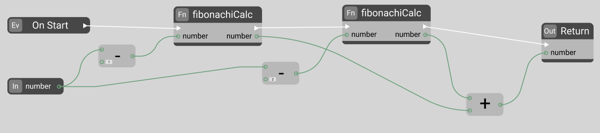

## PomidorLang - is a visual programming language.

PomidorLang (Senior pomidor developer) - это визуальный, функциональный язык программирования, основная идея которого заключается не в полной замене остальных языков программирования, а лишь их расширении путем добавления более высокой абстракции.

## Обзор языка

